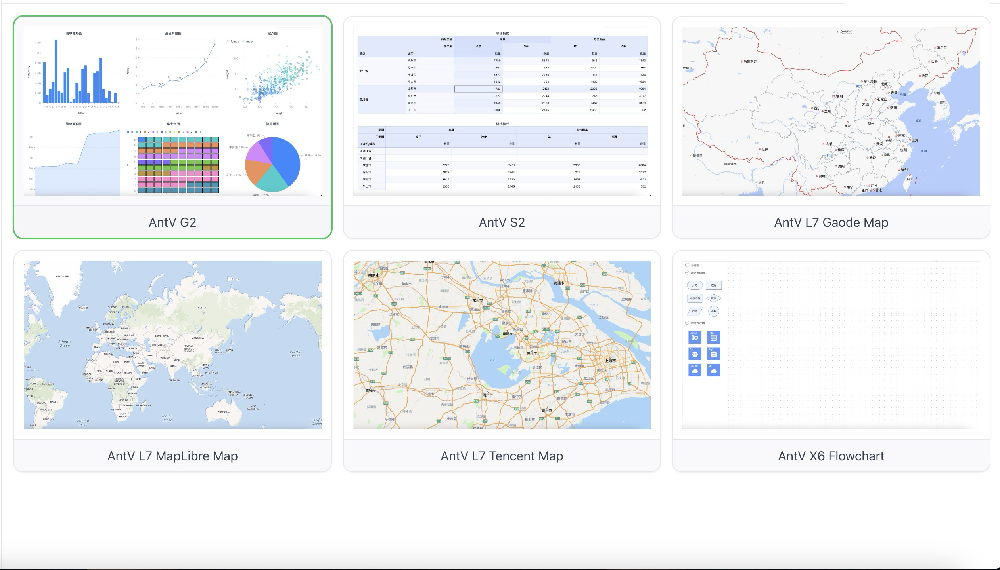

<h1 align="center">
    Dashboard 
</h1>

<div align="center">
    
</div>

# Overview

The Project is built with:
- [Nuxt.js](https://nuxt.com/)
- [Typescript](https://www.typescriptlang.org/)
- [AntV](https://antv.antgroup.com/)

# Preview
  - [Vercel](https://xcodenix-dashboard.vercel.app/)  (VPN is needed in China)
  - [Netlify](https://xingxing-dashboard.netlify.app/)

# Setup

1. Take a copy of `.env.example` and re-name to `.env`
2. Get your Maps key
    - [高德地图](https://lbs.amap.com/api/javascript-api-v2/prerequisites) 
    - [百度地图](https://lbs.baidu.com/index.php?title=jspopularGL/guide/getkey)
    - [Tencent Map](https://lbs.qq.com/webApi/javascriptGL/glGuide/glBasic)
    - [MapBox 地图](https://docs.mapbox.com/help/getting-started/access-tokens/)
    - [MapLibre](https://maplibre.org/)
4. Enter the details into the `.env` file
5. Start the dev server with the following scripts

``` bash
# Enable pnpm
$ corepack enable

# Install dependencies
$ pnpm install

# Start dev server with hot reload at localhost:3000
$ pnpm dev
```
